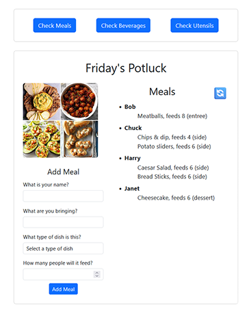
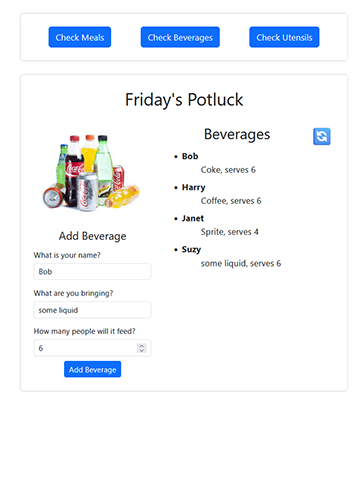
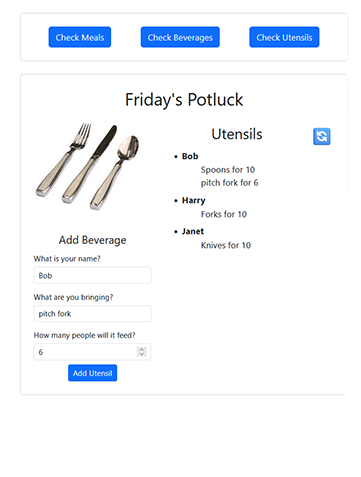

# Potluck Planner (React + Supabase)

A tiny React app for coordinating a team potluck. Guests can add what they’re bringing (meals, beverages, utensils) and the app shows grouped lists by guest using Supabase RPCs for clean formatting.

---

## Project Images

  

---

## Tech Stack

- React (Vite)
- Supabase (Postgres + Auth + RLS)
- Bootstrap (styling)

---

## Quick Start

### 1) Clone & install

```bash
git clone https://github.com/ClayAucoin/lv3-practice-db.git
cd lv3-practice-db
npm install
```

### 2) Supabase project & keys

1. Create a Supabase project at https://supabase.com
2. Grab your **Project URL** and **anon public key**.

Create `.env.local` in your project root (Vite-style envs):

```bash
VITE_SUPABASE_URL=https://YOUR-PROJECT-REF.supabase.co
VITE_SUPABASE_ANON_KEY=YOUR_PUBLIC_ANON_KEY
```

### 3) Create tables, RPCs, and RLS policies

Open Supabase SQL Editor and run the **Database Schema** and **RPC** blocks from the sections below. Then enable RLS and add policies (also below).

### 4) Run the app

```bash
npm run dev     # Vite
```

---

## Database Schema (Tables)

```sql
-- Meals
create table if not exists public.potluck_meals (
  id bigint generated always as identity primary key,
  guest_name varchar not null,
  meal_name  varchar not null,
  dish_type  varchar check (dish_type in ('entree','side','snack','dessert','drink')) not null,
  serves     int2  check (serves >= 0) default 0,
  created_at timestamptz not null default now()
);

-- Beverages
create table if not exists public.potluck_beverages (
  id bigint generated always as identity primary key,
  guest_name    varchar not null,
  beverage_name varchar not null,
  serves        int2  check (serves >= 0) default 0,
  created_at    timestamptz not null default now()
);

-- Utensils
create table if not exists public.potluck_utensils (
  id bigint generated always as identity primary key,
  guest_name   varchar not null,
  utensil_name varchar not null,
  serves       int2  check (serves >= 0) default 0,
  created_at   timestamptz not null default now()
);
```

---

## RPC Functions (Grouped display per guest)

These return one row per guest with a newline-joined list that the UI renders with `white-space: pre-wrap;`.

> Note: `RETURNS TABLE` column order must match your `select` list. The components expect `guest_name` and then an aggregated text column named `meal`, `beverage`, or `utensil`.

```sql
-- Meals
create or replace function get_potluck_meals()
returns table (
  guest_name text,
  meal text
)
language sql as $$
  select
    guest_name,
    string_agg(chr(9) || meal_name || ', feeds ' || serves || ' (' || dish_type || ')', chr(10)) as meal
  from potluck_meals
  group by guest_name
  order by guest_name;
$$;

-- Beverages
create or replace function get_potluck_beverages()
returns table (
  guest_name text,
  beverage text
)
language sql as $$
  select
    guest_name,
    string_agg(chr(9) || beverage_name || ', serves ' || serves, chr(10)) as beverage
  from potluck_beverages
  group by guest_name
  order by guest_name;
$$;

-- Utensils
create or replace function get_potluck_utensils()
returns table (
  guest_name text,
  utensil text
)
language sql as $$
  select
    guest_name,
    string_agg(chr(9) || utensil_name || ' for ' || serves, chr(10)) as utensil
  from potluck_utensils
  group by guest_name
  order by guest_name;
$$;
```

---

## Row Level Security (RLS) & Policies

Enable RLS:

```sql
alter table public.potluck_meals enable row level security;
alter table public.potluck_beverages enable row level security;
alter table public.potluck_utensils enable row level security;
```

For a simple public demo (no auth), you can allow anyone to read RPCs and insert rows. For production, replace with authenticated-only policies.

```sql
-- Demo: allow inserts from anon
create policy "insert_meals_anon" on public.potluck_meals
for insert to anon using (true) with check (true);

create policy "insert_beverages_anon" on public.potluck_beverages
for insert to anon using (true) with check (true);

create policy "insert_utensils_anon" on public.potluck_utensils
for insert to anon using (true) with check (true);

-- Demo: allow reads (RPCs run with caller rights)
grant usage on schema public to anon;
grant execute on function public.get_potluck_meals() to anon;
grant execute on function public.get_potluck_beverages() to anon;
grant execute on function public.get_potluck_utensils() to anon;

-- Optional: allow direct selects (not required if you only use RPCs)
create policy "select_meals_anon" on public.potluck_meals for select to anon using (true);
create policy "select_beverages_anon" on public.potluck_beverages for select to anon using (true);
create policy "select_utensils_anon" on public.potluck_utensils for select to anon using (true);
```

---

## Features

- Add entries for:
  - **Meals** (guest, dish name, dish type, serves)
  - **Beverages** (gueat, beverage name, serves)
  - **Utensils** (guest, utensil name, serves)
- **Grouped display by guest** using Postgres `string_agg` via RPCs.
- **Inline refresh** button per section.
- **Testing mode**: components prefill inputs with sample data when `isTesting = true`.
- **Error handling**: errors from Supabase RPC/insert show as Bootstrap alerts.
- **Clean formatting**: UI renders aggregated lines with natural newlines.

---

## App Structure

```
src/
  App.jsx
  App.css
  components/
    PotluckMeals.jsx
    PotluckBeverages.jsx
    PotluckUtensils.jsx
  images/
    meals.jpg
    beverages.jpg
    utensils.jpg
  utils/
    supabase.js
```

---

## Seed Data (optional)

```sql
insert into public.potluck_meals (guest_name, meal_name, dish_type, serves) values
('Bob','Meatballs','entree',8),
('Chuck','Chips & Dip','side',6),
('Chuck','Potato Sliders','side',10),
('Harry','Caesar Salad','side',6),
('Harry','Bread Sticks','side',8),
('Janet','Cheesecake','dessert',8);

insert into public.potluck_beverages (guest_name, beverage_name, serves) values
('Bob','Iced Tea',8),
('Janet','Sparkling Water',12);

insert into public.potluck_utensils (guest_name, utensil_name, serves) values
('Harry','Plates (pack of 50)',50),
('Chuck','Napkins (pack of 100)',100);
```

---

## License

MIT
